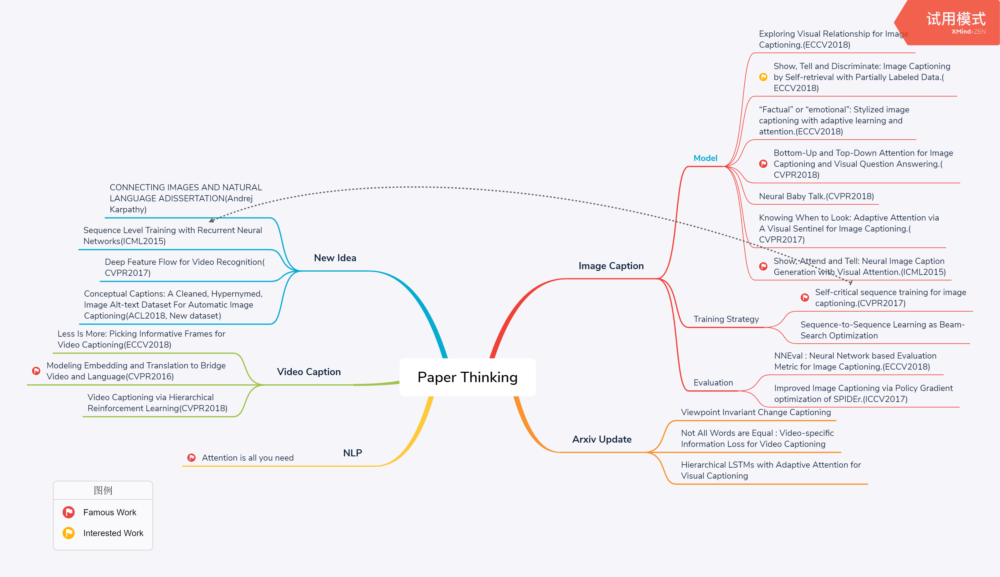

# Paper-Thinking-on-Visual-Captioning

This repo focus on Image/Video Caption &amp; Seq-to-Seq Learning &amp; NLP

## Image Caption

### Model

- Diverse and Accurate Image Description Using a Variational Auto-Encoder with an Additive Gaussian Encoding Space.(**Liwei Wang**, NIPS2017, condition-VAE for caption, [paper](https://arxiv.org/pdf/1711.07068.pdf))
- Rethinking the Form of Latent States in Image Captioning. (ConvLSTM, **DaiBo**, ECCV2018)
- Discriminability objective for training descriptive captions.(retrival+caption, **RuoTian Luo**, CVPR2018)
- Exploring Visual Relationship for Image Captioning.(Detection + GCN, **Ting Yao**, ECCV2018)
- Show, Tell and Discriminate: Image Captioning by Self-retrieval with Partially Labeled Data.(ECCV2018)
- “Factual” or “emotional”: Stylized image captioning with adaptive learning and attention.(ECCV2018)
- Bottom-Up and Top-Down Attention for Image Captioning and Visual Question Answering.(**Peter Anderson**, CVPR2018)
- Neural Baby Talk.(*Pointer Network*, **Jiasen Lu**, CVPR2018)
- Knowing When to Look: Adaptive Attention via A Visual Sentinel for Image Captioning.(**Jiasen Lu**, CVPR2017)
- Show, Attend and Tell: Neural Image Caption Generation with Visual Attention.(ICML2015)

### Training Strategy

- Self-critical sequence training for image captioning.(CVPR2017)
- Sequence-to-Sequence Learning as Beam-Search Optimization

### Evaluation

- Improving Image Captioning with Conditional Generative Adversarial Nets.(AAAI2019, [paper](https://arxiv.org/pdf/1805.07112.pdf))
- NNEval : Neural Network based Evaluation Metric for Image Captioning.(ECCV2018)
- Improved Image Captioning via Policy Gradient optimization of SPIDEr.(ICCV2017)

## NLP

- Attention is all you need([The Annotated Transformer](http://nlp.seas.harvard.edu/2018/04/03/attention.html), [The Illustrated Transformer](http://jalammar.github.io/illustrated-transformer/), [Transformer on ImgCaption](https://github.com/ruotianluo/Transformer_Captioning/blob/master/train.py))
- Latent Alignment and Variational Attention(VAE, [paper](https://arxiv.org/pdf/1807.03756.pdf))
- Variational Neural Machine Translation(VAE for NMT, [paper](https://arxiv.org/pdf/1605.07869.pdf))
- Variational Recurrent Neural Machine Translation(VAE for NMT, [paper](https://arxiv.org/pdf/1801.05119.pdf))

## Video Caption

- Temporal Deformable Convolutional Encoder-Decoder Networks for Video Captioning(AAAI2019 **oral**, [paper](http://home.ustc.edu.cn/~panywei/paper/AAAI19.2277.pdf))
- Less Is More: Picking Informative Frames for Video Captioning(ECCV2018)
- Modeling Embedding and Translation to Bridge Video and Language(CVPR2016)
- Video Captioning via Hierarchical Reinforcement Learning(CVPR2018)
- End-to-End Dense Video Captioning with Masked Transformer(CVPR2018)

## Arxiv Update

- Viewpoint Invariant Change Captioning
- Not All Words are Equal : Video-specific Information Loss for Video Captioning(Jiarong Dong)
- Hierarchical LSTMs with Adaptive Attention for Visual Captioning

## New Idea

- Pointer Network. 
- VideoLSTM Convolves, Attends and Flows for Action Recognition. (ConvLSTM, [paper](http://export.arxiv.org/pdf/1607.01794))
- Detecting and Recognizing Human-Object Interactions(**Ross Girshick**, **Piotr Dollar**, **Kaiming He**, [paper](https://arxiv.org/pdf/1704.07333.pdf))
- CONNECTING IMAGES AND NATURAL LANGUAGE ADISSERTATION(**Andrej Karpathy**)
- Sequence Level Training with Recurrent Neural Networks(ICML2015)
- Deep Feature Flow for Video Recognition(CVPR2017, video object detection, [code.mxnet](https://github.com/msracver/Deep-Feature-Flow), [FlowNet2.pytorch](https://github.com/NVIDIA/flownet2-pytorch))
- Conceptual Captions: A Cleaned, Hypernymed, Image Alt-text Dataset For Automatic Image Captioning(ACL2018, New dataset but not release)

## Newly update! CVPR2019
**Image caption**  
**Video caption**  
- Spatio-Temporal Dynamics and Semantic Attribute Enriched Visual Encoding for Video Captioning.
## Newly update! AAAI2019
**Image caption**  
- 4938: Meta Learning for Image Captioning  
Nannan Li (Wuhan University); Zhenzhong Chen (WHU)*; Shan Liu (Tencent America)

- 5123: Improving Image Captioning with Conditional Generative Adversarial Nets  
CHEN CHEN (Tencent)*; SHUAI MU (Tencent); WANPENG XIAO (Tencent); ZEXIONG YE (Tencent); LIESI WU (Tencent); QI JU (Tencent) [paper](https://arxiv.org/pdf/1805.07112.pdf)(**oral**)

- 5390: Deliberate Residual based Attention Network for Image Captioning  
Lianli Gao (The University of Electronic Science and Technology of China); kaixuan fan (University of Electronic Science and Technology of China); Jingkuan Song (UESTC); Xianglong Liu (Beihang University); Xing Xu (University of Electronic Science and Technology of China); Heng Tao Shen (University of Electronic Science and Technology of China (UESTC))*

- 3934: Connecting Language to Images: A Progressive Attention-Guided Network for Simultaneous Image Captioning and Language Grounding  
Lingyun Song (Xi'an JiaoTong University)*; Jun Liu (Xi'an Jiaotong Univerisity); Buyue Qian (Xi'an Jiaotong University); Yihe Chen (University of Toronto)(**oral**)

- 1410: Hierarchical Attention Network for Image Captioning  
Weixuan Wang (School of Electronic and Information Engineering, Sun Yat-sen University); Zhihong Chen (School of Electronic and Information Engineering, Sun Yat-sen University); Haifeng Hu (School of Electronic and Information Engineering, Sun Yat-sen University)*

**Video caption**  
- 1469: Learning to Compose Topic-Aware Mixture of Experts for Zero-Shot Video Captioning   
Xin Wang (University of California, Santa Barbara)*; Jiawei Wu (University of California, Santa Barbara); Da Zhang (UC Santa Barbara); Yu Su (OSU); William Wang (UC Santa Barbara) [paper](https://arxiv.org/pdf/1811.02765.pdf)(**oral**)

- 2277: Temporal Deformable Convolutional Encoder-Decoder Networks for Video Captioning   
Jingwen Chen (Sun Yat-set University); Yingwei Pan (JD AI Research)*; Yehao Li (Sun Yat-Sen University); Ting Yao (JD AI Research); Hongyang Chao (Sun Yat-sen University); Tao Mei (AI Research of JD.com) [paper](home.ustc.edu.cn/~panywei/paper/AAAI19.2277.pdf)(**oral**)

- 2389: Fully Convolutional Video Captioning with Coarse-to-Fine and Inherited Attention  
Kuncheng Fang (Fudan University)*; Lian Zhou (Fudan University); Cheng Jin (Fudan University); Yuejie Zhang (Fudan University); Kangnian Weng (Shanghai University of Finance and Economics); Tao Zhang (Shanghai University of Finance and Economics); Weiguo Fan (University of Iowa)

- 2732: Motion Guided Spatial Attention for Video Captioning   
Shaoxiang Chen (Fudan University)*; Yu-Gang Jiang (Fudan University) [paper](http://yugangjiang.info/publication/19AAAI-vidcaptioning.pdf)

- 3468: Learning Object Context for Dense Captioning   
Xiangyang Li (Institute of Computing Technology, Chinese Academy of Sciences); Shuqiang Jiang (ICT, China Academy of Science)*; Jungong Han (Lancaster University)
